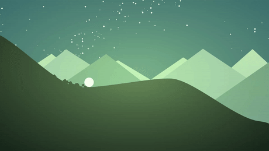
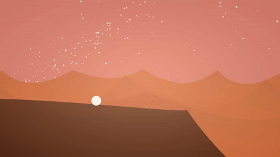

# Procedural 2D Terrain

 

Procedurally generated, 2D side-scrolling terrain using splines.

   
  <i><b>Figure 1:</b> Mountainous terrain with a green colour palette.</i>

   
  <i><b>Figure 2:</b> Desert terrain with a dusk colour palette.</i>

   
  <i><b>Figure 3:</b> Desert terrain with a warm colour palette.</i>

